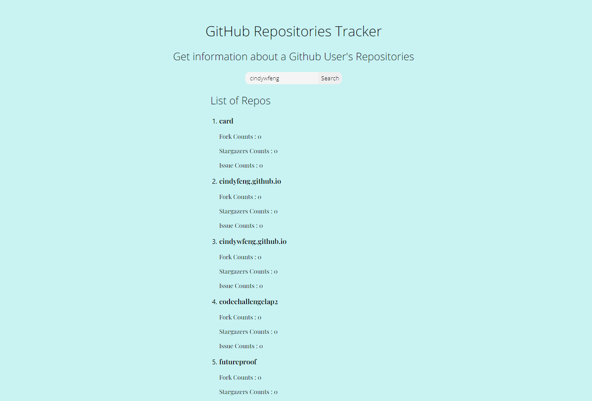

# React GitHub Repositories Tracker

## Contributors
Tashbeeh Farid ([@tashbeeh25](https://github.com/tashbeeh25)), Cindy Feng ([@cindywfeng](https://github.com/cindywfeng))

## Run Instructions

- Fork repo
- Change App.js intial render as desired
- Clone contents of fork into desired new repo
- Clone new repo to machine
- In new repo run `npm install` 
- In new repo run `npm start`
- if there are any issues try install Babel and add a .babelrc file

